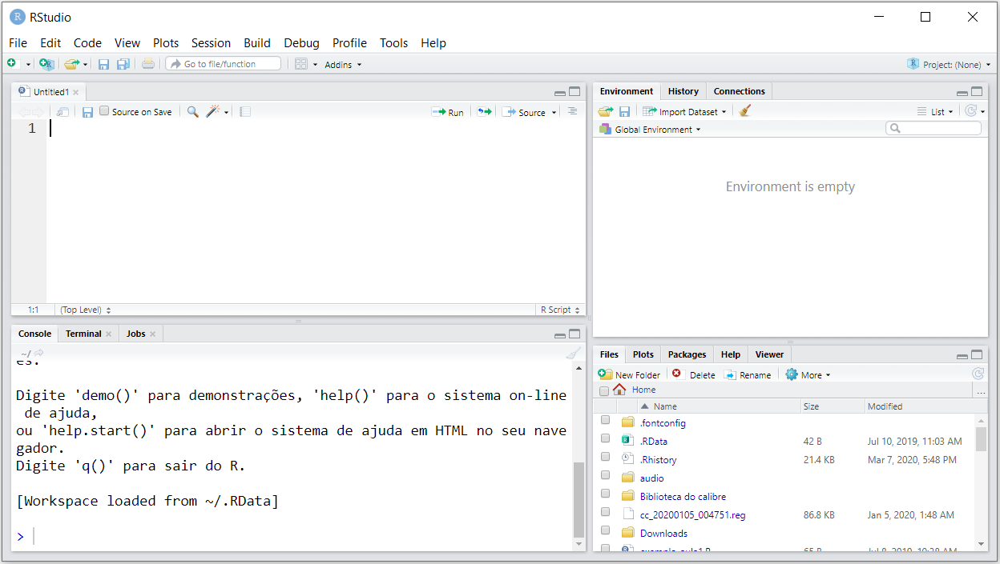
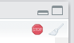
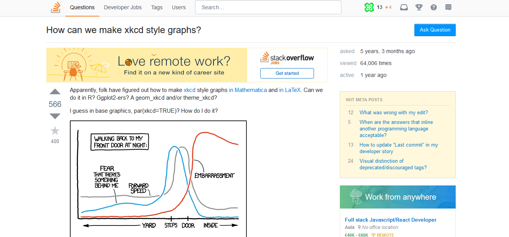

# Módulo II

## Guardando seus códigos em um script

No RStudio, você pode acrescentar um pequeno painel, que facilitará ainda mais o seu trabalho. Trata-se do _source pane_, um painel onde você pode criar scripts para armazenar várias linhas de código, de modo a excutá-las de uma única vez ou linha-a-linha.  Caso queira guardar as contas e comparações lógicas que fez anteriormente em um arquivo de modo a poder executá-las posteriormente, você poderá fazê-lo por meio de um script. Na janela de script, você consegue manter uma trilha de todos os comandos utilizados.

Isto é importante, pois otimiza o uso do R ao permitir rodar os mesmos códigos para diferentes arquivos e diferentes ocasiões, em vez de termos que refazer toda a programação a cada vez que mudarem nossos dados de entrada. 
Você pode abrir várias janelas de script, uma ao lado da outra e navegar entre elas, como se faz com as abas de um navegador. Neste curso, faremos todas as aulas e exercícios utilizando os arquivos de script.

Para acrescentar a janela de script (_source pane_), basta criar um novo arquivo, clicando em , logo abaixo de _File_, e em seguida em . Nossa janela do RStudio deve ficar conforme a figura a seguir. 



Vamos acrescentar todas as linhas de códigos que executamos anteriormente ao nosso script recém criado.


**DICA:** Você pode inserir comentários em seus scripts como uma forma de documentar os passos de seu trabalho para refrência futura. No R, os comentários são incluídos com o caractere `#`.

Para salvar o arquivo de script, basta executar `Ctrl+S` ou clicar no disquete único na barra de menus. Esse arquivo será salvo com extensão _.R_, indicando que se trata de um arquivo com códigos da linguagem R. 

**DICA:** Sugerimos que você crie e salve um ou mais scripts a cada aula do curso. Isso o ajudará a organizar seu material e recuperar conceitos e exemplos importantes durante e após o curso.

Você pode executar todos as linhas de um script ou optar executar apenas algumas poucas linhas ou trechos específicos desse código. Selecione o trecho que deseja executar e pressione `Ctrl+Enter`. Você verá, no console (janela abaixo do script) seu código sendo executado. Uma alternativa ao `Ctrl+Enter` é selecionar o trecho ou linha(s) e clicar em  .

Na maioria das vezes, nosso código pode levar um tempo considerável para ser executado completamente. Para saber se o interpretador ainda está ocupado executando o seu código, basta olhar para o canto direito do painel _Console_. Se você ver o símbolo , o interpretador ainda está ocupado executando a última sequência de comandos. O símbolo `>` também não aprecerá livre no console. Você pode tentar parar a execução clicando no ícone de _stop_. No entanto, nem sempre será possível interrompê-la.

Tente gerar uma distribuição normal com 100 milhões de entradas:

```{r, eval=FALSE}
rnorm(1:100000000)
```


**DICA:** Pode acontecer ainda de você olhar para o console e não ver o símbolo `>`, sem que tenha aparecido o ícone de *stop* no canto direito do painel. Isso geralmente acontece quando esquecemos de fechar algum parenteses, chave ou colchete aberto no início de uma linha de código. Faça um teste:

```{r, eval=FALSE}
((1007+1)/8^2
```

O console ficará esperando você completar o código. Você tem duas opções, acrescentar o parênteses faltante (caso seja possível), ou pressionar `Esc`, consertar o código e executá-lo novamente.

#### Aba _Environment_

Todos os objetos que forem criados na sua sessão do R/RStudio serão automaticamente armazenados no que chamamos de _Global Environment_, representado pela aba _Environment_ no RStudio. 


Note que até o momento, nosso _Environment_ encontra-se vazio. Isso porque ainda não "guardamos" nenhum objeto ou resultados das operações que realizamos anteriormente.

##### Atribuição de objetos no R

Para criarmos um objeto no R, seja para aramazenar um valor específico ou o resultado de uma operação, utilizamos o sinal de atribuição característico do R `<-`, i.e. `a <- b` (lê-se _a recebe o valor de b_). Pode-se utilizar ainda o sentido contrário: `b -> a` (_a recebe o valor de b_), ou ainda o sinal de igual `=`. Essas alternativas são menos convencionais. Sugerimos a utilização de `a <- b` para que não se confunda a criação de objetos com a passagem de parâmetros em argumentos de funções mais a frente.

Para criar um objeto/variável **x** que contém o valor **2**, execute:

```{r}
# x recebe 2
x <- 2
# para ver o valor de x:
x
```


**DICA:** O atalho para o operador de atribuição `<-` é `Alt+-`.

Note agora que nossa aba _Environment_ não está mais vazia:


Agora vamos salvar os resultados de algumas operações aritiméticas e de comparações lógicas:

```{r}
out1 <- 789/34.5
out2 <- 3^2
out3 <- out1 > out2
```


Vejamos como ficou nosso _Environment_ com os novos objetos criados:


O R é bastante liberal no que se refere a sua política de nomes de objetos. As proibições são apenas as seguintes:

* um nome não pode iniciar com algarismo, ex: `1out <- 2`;
* um nome não pode conter apenas algarismos, ex: `01 <- 2`;
* um nome não pode conter caracteres especiais, **a não ser** `.` ou `_`, ex: `out#01 <- 2`
* um nome não pode ser idêntico a uma palavra utilizada como _token_ da linguagem R, ex: `TRUE <- 2`; `for <- 2`, etc.

**DICA:** A linguagem R é _case sensitive_, ou seja, ela faz distinção entre letras maiúsculas e minúsculas de um nome. Portanto `Nome_do_Objeto != nome_do_objeto`!

#### Salvando os objetos do Environment

E se você quiser salvar esses objetos criados na sua sessão de R, para continuar trabalhando neles posteriormente? É possível fazê-lo e é simples.

Para salvar todos os objetos do seu Environment, clique em `Session` e `Save Workspace As...` no RStudio. Será salvo um arquivo com extensão `.RData` com o nome e caminho que você especificar. 

Uma alternativa também seria:

```{r, eval=FALSE}
save.image("C:\\caminho_para_pasta_de_preferencia\\meu_workspace.RData")
# ou
save.image("C:/caminho_para_pasta_de_preferencia/meu_workspace.RData")
```

**DICA:** A barra invertida `\` tem uma função especial no R, ela funciona como um caractere de escape, o quê veremos mais a fundo em sessões futuras. Portanto, para que uma barra invertida deixe de ter sua função especial, precisamos "escapá-la" com outra barra invertida. Por isso, usamos duas barras em endereços do Windows. Uma forma de contornar isso é usar barras normais, como no Linux. Mesmo no Windows, o R saberá que você está especificando um caminho Windows.

Para carregar o arquivo salvo em sessões futuras, você tem novamente duas alternativas. A primeira é clicar em `Session` e `Load Workspace...` no RStudio. A segunda é:

```{r, eval=FALSE}
load("C:\\caminho_para_pasta_de_preferencia\\meu_workspace.RData")
```

Se você quiser salvar elementos específicos e não todo o environment, você pode fazê-lo da seguinte forma:

```{r, eval=FALSE}
save(out1, out2, file="C:\\caminho_para_pasta_de_preferencia\\meu_workspace.RData")
```

Para carregar esses objetos, você tambpem usará a função `load()`.

**DICA:** Para salvar e carregar um único elemento, como por exemplo um dataset (tabela) que foi trabalhado, mas que deverá ainda ser carregado em uma nova sessão, você pode usar as funções  `saveRDS()` e `readRDS()`.


### Estrutura da linguagem R

**R** pode ser considerado uma linguagem de programação funcional, uma vez que a maioria dos procedimentos e rotinas são realizadas por meio de funções que recebem alguns argumentos como _input_, executam algumas ações sobre esses argumentos e retornam um output. Grosso modo, o uso de funções se dá da seguinte forma: 

```{r, eval=FALSE}
nome_da_funcao(argumento1 = valor1, argumento2 = valor2, ...)
```

Embora os operadores aritiméticos e lógicos vistos anteriormente não se enquadrem na estrutura funcional descrita acima, acabam por operar internamente como funções.

Como você verá mais à frente, qualquer usuário pode criar uma função no R e não somente utilizar as disponibilizadas pela distribuição default da linguagem.

**DICA:** Não precisamos utilizar sempre o formato `nome_argumento=valor` dentro das funções, pois o R é inteligente o suficiente para fazer o _matching_ dos argumentos pela posição em que são passados (`nome_da_funcao(valor1, valor2)`) ou mesmo pelas letras iniciais do argumento informado.

Vejamos alguns exemplos de funções que executam oeprações matemáticas e que já vem _de fábrica_ no _base R_ (distribuição básica do R):

**DICA:** O RStudio possui a funcionalidade de autocompletar as palvras que você digita com os objetos criados durante sua sessão R ou já existentes na memória. Quando for digitar as funções abaixo, faça um teste digitando as primeiras duas letras de cada função e pressiona `TAB`.

```{r}
# raiz quadrada
sqrt(81)
# juntando com priorização de operações
sqrt((3*3)^2)
## produtório
prod(2,2) # 2x2
prod(2,3,5,7,8) # 2x3x5x7x8
## logaritmo
# log de 3 na base e
log(3) # log natural
# log de 3 na base 10
log(3,10)
# log3 na base 10
log10(3)
# abs = modulo, |3 - 9|
abs(3-9)
# fatorial
# 4 fatorial
factorial(4)
```


## Pacotes no R {#pkg}

Um dos motivos do grande sucesso da linguagem R deve-se ao fato de que qualquer usuário pode desenvolver uma "suíte" contendo diversas funções, para executar uma ou várias tarefas. Esse conjunto ou suíte de funções pode ser disponibilizado na forma de um pacote, o qual outros usuários poderão instalar e também dele usufruir. Após cumprir uma série de exigentes requisitos, esses pacotes geralmente são disponibilizados no [Comprehensive R Archive Network (CRAN)](https://cran.r-project.org).

O CRAN possui uma política bastante séria de revisão de pacotes. Para que um pacote R possa compor o repositório do CRAN, deve atender a uma série de exigências e ser aprovado em diversos testes focados essencialmente nos seguintes fatores: segurança para o usuário; funcionamento sem erros em pelo menos dois sistemas operacionais; documentação densa (inclusive com citações bibliográficas) sobre as funcionalidades do pacote.

Tudo isso faz com que os pacotes disponibilizados no CRAN sejam bastante confiáveis, transformando-se assim na fonte oficial de distribuição de pacotes da linguagem. 

Se você quiser saber o número de pacotes disponíveis no CRAN hoje, execute:

```{r, eval=FALSE}
dim(available.packages(contrib.url(getOption("repos")), filters=list()))[1]
```

Em números de março de 2020, como você deve ter notado, temos mais de 15 mil pacotes no CRAN para as mais diversas finalidades. Para saber os tipos de pacotes existentes no repositório, recomenda-se uma visita ao [_Task Views_](https://cran.r-project.org/web/views/) do CRAN. Há pacotes de Econometria, Análise Econômica Regional, Estatítica, Clusterização, Ensaios Clínicos, Séries Temporais, Otimização, Tratamento de Dados, Aprendizagem de Máquina e muitos outros.

### Instalação de pacotes

Para instalar pacotes disponíveis no CRAN, deve-se utilizar a função `install.packages("nome_do_pacote")`, passando-se o nome do pacote desejado entre aspas como argumento da função.

Vamos testar essa funcionalidade instalando o pacote `REAT - Regional Economic Analysis Toolbox`, que é um pacote que você provavelmente utilizará bastante em suas análises no IPEA:

```{r, eval=FALSE}
install.packages("REAT")
```

Se o pacote foi corretamente instalado, você deve ver algo semelhante a seguinte mensagem no console:

```{sh, eval=FALSE}
package ‘REAT’ successfully unpacked and MD5 sums checked
The downloaded binary packages are in
	C:\Users\...\...\...\...\...\downloaded_packages
>
```

Não se assuste caso outros pacotes também tenham sido instalados. Isso é muito comum, uma vez que alguns pacotes podem recorrer a funções presentes em outras bibliotecas.

Para carregar ou anexar o pacote à sua sessão no R, de modo que você possa utilizar as funções disponíveis nele, empregamos a função `library(nome_do_pacote)` ou `require(nome_do_pacote)`. Neste caso, o nome do pacote pode vir com ou sem aspas.

```{r, eval=FALSE}
library(REAT)
```

Se você não quiser carregar um pacote completamente em sua sessão do R, porque vai apenas utilizar uma função específica, ao invés de `library()`, você pode usar o formato `nome_do_pacote::nome_dafunção(parâmetro)`.

### Outras fontes de pacotes

Cabe destacar que a versão básica instalada do R, que chamamos de `base R`, já vem com alguns pacotes instalados, como por exemplo os pacotes `stats`, `MASS`, `foreign`, `graphics`, o próprio `base`, dentre outros. Para listar todos os pacotes instalados em sua máquina, execute:

```{r, eval=FALSE}
installed.packages()
```

Embora o CRAN seja o repositório oficial de pacotes R, é importante mencionar a existência de outras fontes também importantes para obtenção de pacotes.

A primeira das fontes alternativas é o [**Bioconductor**](https://www.bioconductor.org/), que é um projeto _open source_ de desenvolvimento de softwares relacionados à análise e compreensão de dados genômicos gerados em experimentos de laboratório relacionados a biologia molecular. É, portanto, um importante repositório de pacotes para quem trabalha com _Bioinformatics_ ou _Biostatistics_.

A segunda fonte seria o [**Github**](https://www.github.com) que é um sistema para gerenciamento e versionamento de código. Qualquer pessoa pode criar uma conta no github e começar a compartilhar seus códigos, os quais poderão ser acessados e modificados/melhorados (com o consenso do autor original). No caso do R, os pacotes normalmente possuem uma versão _estável_ no CRAN e uma versão de _desenvolvimento_ no Github, onde os autores e demais colaboradores estão trabalhando no melhoramento e resolução de _bugs_ dos pacotes. Uma vez que a versão do GitHub esteja estável e pronta para lançamento, o autor pode enviá-la ao CRAN.


## Como obter ajuda

Essa talvez seja a parte mais importante de todo o material. Saber **como** e **onde** buscar ajuda pode significar gastar apenas alguns minutos ao invés de horas ou mesmo dias na resolução de um problema envolvendo análise de dados e programação. Ao longo deste curso e ao empregar R em uma atividade de trabalho, vocês vão se deparar com diversas dúvidas envolvendo lógica de programação, análise de dados, ou mesmo buscando sabe se existe algum pacote já implementado que realize a tarefa que vocês precisam.

### O _Help_ do R

O primeiro local para se buscar ajuda sobre algo relacionado ao R, normalmente está dentro do próprio R ou RStudio. Conforme meniconamos na seção \@ref(#pkg), a política do CRAN exige que os pacotes estejam muito bem documentados. E isso ajuda muito aos usuários e desenvolvedores. Além da documentação do `base R`e dos demais pacotes que já acompanham a instalação padrão, ao instalar um novo pacote, a documentação desta nova biblioteca passa a compor o _help_ do R instalado em sua máquina. Então, quando queremos entender uma função, ou seja, conhecer  seus parâmetros de entrada, o que ela faz e o que retorna, recomenda-se utilizar o _help_ do próprio R.

No painel direito inferior, você encontra uma série de abas, sendo que a 3ª delas é aba que exibe o material de ajuda. Você pode fazer as buscas utilizando o campo de pesquisa da própria aba, ou por meio de comandos inseridos no console.


Um exemplo: imagine que você gostaria de saber se o R possui alguma função que calcula o logaritmo (base $e$) de um número. Para isso, temos a função `help.search()`, que recebe como parâmetro ("entre aspas") o tópico sobre o qual você deseja pesquisar. Toda a ajuda do R está em inglês; por isso, se você quer encontrar algo relacionado à logaritmo, deve executar o comando `help.search("logarithm")` ou `??logrithm`.

Vejamos:

```{r, eval=FALSE}
# alternativa 1
help.search("logarithm")
# ou
# alternativa 2
??logarithm
```

Na aba _Help_ do RStudio aparecerá o resultado dos pacotes e as respectivas funções que contém as palavras que você buscou. Nesse caso, portanto, caso, temos a função `log()` do pacote base para calcular logaritmos. Veja:


Se você já sabe exatamente o nome da função ou objeto do R sobre o qual deseja obter ajuda, pode utilizar também `help("palavra")` ou `?palavra`.

```{r, eval=FALSE}
# alternativa 1
help("log")
# ou
# alternativa 2
??log
```


Geralmente, os tópicos mais importantes dos arquivos de ajuda são _Description_, _Usage_, _Arguments_ e _Examples_. O primeiro mostra o que a função faz, o segundo como a função deve ser usada, o terceiro quais argumentos ela recebe e, no quarto, você encontra exemplos de como ela funciona. _Value_ também pode ser interessante, pois informa qual tipo de objeto a função retorna.

#### _Vignettes_

Mais a frente, veremos como instalar novos pacotes no R. Esses pacotes são como módulos adicionais que permitem ao usuário realizar mais operações e atividades na linguagem. Muitos desses pacotes trazem consigo, além da documentação básica, verdadeiros tutoriais sobre como utilizar o pacote em si ou funções específicas desses pacotes. São muito mais detalhados que a simples documentação do _Help_ do pacote ou de uma função. Enquanto alguns não fornecem qualquer _vignette_, outros podem trazem mais de uma _vignette_. Caso você queira verificar utilize:

```{r, eval=FALSE}
vignette("nome_do_pacote")
```


#### Ajuda via Internet


R é bastante conhecido por sua comunidade extremamente ativa. Muitas vezes, ao analisar dados, surgem problemas que não são passíveis de solução apenas com a documentação interna da linguagem. Nesses casos, é necessário recorrer à experiência de outros usuários que tenham vivenciado o problema e que possam dar dicas de como ao ponto desejado. Nos 20 anos do R, vai ser difícil não encontrar alguém que vivenciou o mesmo problema que você. Nesse ponto a internet é nossa melhor amiga e não é vergonha nenhuma procurar ajuda lá. Dos mais inexperientes usuários da linguagem aos mais talentosos desenvolvedores de R, todos, sem excessão, acabam recorrendo a internet como uma valiosa fonte de informação e ajuda. Existem livros gratuitos, blogs com excelentes tutoriais, fóruns e sites de perguntas e respostas (Q&A).

Neste último caso, não há como não mencionar o [StackOverflow](http://www.stackoverflow.com), que é um site de perguntas e respostas especializado em programação em geral. A comunidade de R no StackOverflow é extremamente ativa e uma das maiores do site. Lá você encontrará usuários iniciantes, intermediários, avançados, desenvolvedores de pacotes e até mesmo gente que atua na atualização da linguagem e do RStudio. Há uma versão em português e uma em inglês. Recorra à versão em inglês do site, por ser obviamente muito mais ativa.

Antes de postar uma pergunta lá faça uma busca com os termos que deseja, por exemplo: _"How do a scatter plot in R?"_. Se digitar isso na busca do site ou mesmo no Google, nos primeiros resultados você já terá as respostas necessárias do StackOverflow para fazer um _scatterplot_ no R, pelo menos de 3 formas diferentes, usando pacotes diferentes.


Veja um exemplo de pergunta e resposta no StackOverflow:




***

***

## Estrutura de Objetos da Linguagem R

Entender a estrutura de criação e manipulação de objetos no R será essencial para impulsionar sua velocidade de aprendizado nas demais sessões do curso. O bom aproveitamento dos tópicos mais práticos dependem muito de um entendimento sólido sobre os objetos da linguagem R.

Tudo (ou quase tudo) no R são objetos. Os mais importantes são:

* **Vetores**: são uma espécie de array unidimensional. Consistem em uma sequência de valores que podem ser: numéricos, caracteres ou expressões lógicas (como TRUE ou FALSE). Ressalta-se que as entradas de um vetor podem ser somente de um único tipo.

Exemplo:

```{r,echo=FALSE}
v1 <- head(iris[,1]); v1
```

* **Matrizes**: são arrays multidimensionais com coleção de vetores em linhas ou colunas, sendo que todos os vetores da coleção possuem o mesmo tipo e tamanho.

Exemplo:

```{r, echo=FALSE}
m2 <- matrix(rep(c("R", "IPEA"), 5), ncol=2); m2
```

* **Dataframes**: são praticamente idênticos às matrizes, mas com a possibilidade de se ter uma coleção de vetores (colunas) de diferentes tipos (ex: um vetor numérico e outro vetor de caracteres). Por essa característica, é o principal objeto utilizado para armazenar tabelas de dados no R.

Exemplo:

```{r,echo=FALSE}
df1 <- head(iris, 10); df1
```

* **Listas**: é o tipo mais amplo de objeto, que pode reunir coleções de dataframes, vetores e/ou matrizes, ou ainda de todos eles. Uma característica da lista é que, uma vez que os objetos dentro dela não precisam ser do mesmo tipo, também não há a necessidade de que sejam do mesmo tamanho. Isso, muitas vezes, é de grande auxílio na manipulação de dados.

Exemplo:

```{r,echo=FALSE}
v2 <- c("R", "IPEA", "2020")
m1 <- matrix(runif(2^2), 2)
minha_lista <- list(v2, head(iris, 5), m1)
minha_lista
```

* **Funções**: são um conjunto de procedimentos que recebem zero, um ou mais parâmetros como _input_, realizam um cálculo ou procedimento e retornam um resultado para o usuário. Como você pode perceber até funções são consideradas objetos no R.

Exemplo:

```{r, echo=FALSE}
log
```

Nesta seção, estudaremos mais a fundo a criação e manipulação de vetores e Dataframes, que julgamos serem os objetos mais importantes para este curso. A criação de funções será objeto de estudo do Módulo 
<!-- \@ref(m5). -->


### Vetores

#### Como criar um vetor

No R há 3 tipos de vetores: númericos (_numeric_), de caracteres ou _strings_ (_character_) e vetores lógicos (_logic_). Todos eles são criados por meio da função `c()`, sendo o "c" de _concatenate_. Esta função faz a concatenação de elementos de um mesmo tipo, produzindo, assim um vetor. Os parâmetros a serem passados são os elementos que comporão o vetor e devem ser separados por vírgulas.

**Vetor numérico:**

```{r}
v1 <- c(1, 0.2, 0.3, 2, 2.8); v1
```

**DICA:** Ao usar `;`, você indica ao R que está separando a execução do código, embora haja duas operações na mesma linha - uma que cria o vetor e outra que imprime o resultado no console ao chamar o nome do objeto.

**DICA:** Os vetores numéricos podem ser de dois tipos: _integer_, para números inteiros ou _double_, para ponto flutuante (números decimais). Para saber o tipo de um vetor, use a função `typeof(nome_vetor)`


**Vetor de caracteres ou _strings_:**

```{r}
v2 <- c("R", "IPEA", "2020", "R", "IPEA", "2020"); v2
```

**DICA:** Note que as strings devem ser passadas `"entre aspas"`.

**Vetor lógico:**

```{r}
v3 <- c(TRUE, FALSE, FALSE, TRUE, TRUE, FALSE, FALSE, TRUE); v3
```


Experimente misturar dois vetores. Como os vetores só podem ser de um único tipo, o R automaticamente forçara o resultado final para um único tipo.

Exemplo:

```{r}
v4 <- c(v1, v2); v4
v5 <- c(v1, v3); v5
v6 <- c(v2, v3); v6
seq(-1, -10)
```

A função `typeof(nome_do_vetor)` pode ser usada para confirmar os tipos dos vetores que você criou.

##### Outras formas de criar um vetor

Há outras funções interessantes que possibilitam criar vetores:

* `:`, exemplo: `1:100`, cria um vetor numérico composto pela sequência de 1 a 100;
* `seq()`, exemplo: `seq(-10, -1)`, cria um vetor numérico composto pela sequência de -10 a -1;
* `rep()`, exemplo: `rep("IPEA", 10)`, cria um vetor composto pela _string_ `"IPEA"` repetida 10 vezes.

#### Como extrair elementos de um vetor

Para extrair elementos de um vetor (e de qualquer objeto no R), utilizamos a indexação por meio de colchetes `nome_do_vetor[posição]`. Você pode informar uma única posição, um conjunto de posições ou mesmo um intervalo de posições a extrair:


**Extraindo um único elemento:**

```{r}
# 3º elemento do vetor v1
v1[3]
# 1º elemento do vetor v2
v2[1]
# 5º elemento do vetor v3
v3[5]
```


**Extraindo mais de uma elemento:**

Aqui você usará um vetor dentro de outro vetor. A ideia é que o vetor dentro dos colchetes `[]` contenha as posições (índices) a serem extraídas do vetor original. Lembre-se que o vetor contendo as posições deverá ser criado e, para criar um vetor, usamos a função `c()`.

```{r}
# 1º e 3º elementos do vetor v1
v1[c(1,3)]
# ou
pos1 <- c(1,3)
v1[pos1]
# 2º e 4º elemento do vetor v2
v2[c(2,4)]
# ou
pos2 <- c(1,3)
v2[pos2]
# 1º, 2º e 5º elemento do vetor v3
v3[c(1,2,5)]
# ou
pos3 <- c(1,2,5)
v3[pos3]
```


**Extraindo elementos em um intervalo:**

Mais uma vez usaremos vetor dentro de vetor. A diferência é que criaremos um vetor utilizando a função `:`, a qual cria uma sequência de valores ou intervalo. Podemos utilizar ainda a função `seq(a,b)`

```{r}
# do 1º ao 3º elementos do vetor v1
v1[1:3]
# ou
v1[seq(1,3)]
# do 2º ao 5º elemento do vetor v2
v2[2:5]
# ou
v2[seq(2,5)]
# do 3º ao 6º elemento do vetor v3
v3[2:6]
# ou
v3[seq(2,6)]
```

#### Como calcular o tamanho de um vetor?

**DICA:** Para calcular o tamanho de um vetor, use a função `length(nome_vetor)`:

```{r}
length(v6)
```

#### Como alterar elementos de um vetor

Uma vez que você entendeu o processo de indexação de vetores. Você pode alterar ou substituir um ou mais elementos de um vetor, usando ndexação e atribuição.

```{r}
v1[2] <- 450.78
v2[3] <- 2021
v3[c(3,5)] <- c(TRUE, FALSE) # a substituição tem que ser do mesmo tamanho do resultado da indexação
```

### Dataframes

Os Dataframes são as "tabelas" do R. Provavelmente será um dos objetos que você mais utilizará para fazer análise de dados. O Dataframe possui linhas e colunas. Pense nas colunas como vetores, onde cada uma das posições desse vetor indica uma linha. Podemos pensar os Dataframes, então, como uma coleção de vetores, que podem inclusive ser de tipos diferentes, mas necessariamente devem possuir o mesmo tamanho. Isso faz todo sentido, pois numa tabela temos variáveis numéricas, nomes, e outros tipos que não serão tratados neste curso, como datas, por exemplo.

#### Como criar um Dataframe

Para criarmos um dataframe, utilizamos a função `data.frame()`. No entanto, o mais comum é que o dataframe seja criado a a partir da leitura de alguma base de dados, por meio das funções de leitura que serão apresentadas principalmente no Módulo \@ref(m2).

Vamos criar um dataframe de 3 colunas. Os argumentos principais são os vetores que compõem as colunas. 

```{r}
# OBS: todos os vetores precisam ter o mesmo tamanho
v6 <- 11:15
v7 <- seq(0.3, 0.7, by=0.1)
v8 <- rep("IPEA", 5)
v9 <- rep(c(TRUE, FALSE), 5)
df1 <- data.frame(v6, v7, v8, v9)
df1
```

**DICA:** Há vários outros argumentos que também podem ser usados. Vejamos a estrutura da função `data.frame()`. Vale a pena consultar o help da função `data.frame` também (`help(data.frame)`).

```{r, eval=FALSE}
data.frame
help("data.frame")
```

Durante a criação de um dataframe, podemos escolher outros nomes para as colunas:

```{r}
df1 <- data.frame(col1 = v6, col2 = v7, col3 = v8, col4 = v9)
# ou
# df1 <- data.frame("col1" = v6, "col2" = v7, "col3" = v8, "col4" = v9)
df1
```


Você deve ter notado que há sempre um coluna à esquerda que contem a numeração ou nomes das linhas do seu dataframe. É o que chamamos de `rownames`.

**DICA:** Se você quiser confirmar a **estrutura** de seu dataframe, ou seja, saber o tipo de suas colunas, use a função `str(nome_data_frame)`

```{r}
str(df1)
```


Note que a coluna 2 `col2` foi tratada como _factor_ e não como _character_, como esperávamos. _factor_ é uma abstração que o R utiliza para salvar variáveis categóricas na memória de modo a ocupar menos espaço. Basicamente, ele converte as categorias em um número, de modo a otimizar a utilização de memória. Se a variável for impressa no console, ele faz uma reconversão apenas para apresentá-la ao usuário. Para que a `col2` seja realmente criada como uma coluna do tipo `character`, devemos setar o parâmetro `stringsAsFactors = FALSE`. Guarde bem essa dica, pois você usará esse mesmo parâmetro ao ler dados externos, transformando-os em dataframes no R. 

```{r}
df1 <- data.frame(col1 = v6, col2 = v7, col3 = v8, col4 = v9, stringsAsFactors = FALSE)
str(df1)
```

**DICA:** A partir da versão __4.0.0__, não é mais necessário declarar `stringsAsFactors = FALSE` na função data.frame. Este passou a ser o comportamento padrão da função: __não__ transformar colunas de strings em fatores.
Note que, diferentemente dos vetores que eram unidimensionais, os dataframes são bidimensionais. Temos uma dimensão representada pelas linhas e outra dimensão representada pelas colunas. Para calcular as dimensões de seu dataframe você pode usar utilizar as seguintes funções:

```{r}
# linhas vs colunas
dim(df1)
# nro de linhas
nrow(df1)
# nro de colunas
ncol(df1)
```


#### Como extrair elementos de um Dataframe

Para extrair os elementos de um Dataframe, utilizaremos a mesma técnica de indexação dos vetores, usando colchetes `[]`. A diferença é que, como o Dataframe possui duas dimensões, precisamos trabalhar com ambas, separando os índices de cada dimensão com um vírgula dentro dos colchetes `nome_df[índice_linhas, indice_colunas]`. 

Agora, os valores que passarmos dentro dos colchetes referem-se às linhas ou as colunas de um Dataframe. É como jogar batalha naval. 

**DICA:** Se você quiser extrair apenas linha(s) inteira(s), deixe a dimensão da coluna em branco, ex: `nome_df[linha_X, ]`. Se você quiser extrair apenas coluna(s), deixe a dimensão das linhas em branco, ex: `nome_df[, coluna_Y]`.

**Extraindo uma ou mais linhas:**

```{r}
# única linha
df1[3, ]
# algumas linhas
# note o posicionamento das vírgulas
df1[c(1,2,5), ]
# uma sequência de linhas
df1[3:5, ]
```


**Extraindo uma ou mais colunas:**

```{r}
# única coluna
df1[ ,2]
# algumas colunas
# note o posicionamento das vírgulas
df1[, c(2,3)]
# uma sequência de colunas
df1[, 2:4]
```

**Extraindo elementos específicos, cruzando linhas e colunas**

Você pode misturar índices de ambas dimensões, para extrair subconjuntos específicos do seu Dataframe. É como jogar batalha naval:

```{r}
# elemento único
# elemento no cruzamento da 2ºlinha e 3º coluna
df1[2, 3]
# subconjuntos
# elementos no cruzamento da 2ª e 5ª linha vs 1ª e 4ª coluna
df1[c(2,5), c(1,4)]
# subconjuntos
# sequência da 2ª a 4ª linha vs sequência da 3ª a 5ª linha
df1[1:3, 2:4]
```

**DICA:** Você também pode misturar os exemplos anteriores, por exemplo: `df1[2, 2:4]`.

#### Outras formas de indexar as colunas de um Dataframe

Há mais duas formas de indexar as colunas de um Dataframe. Ambas utilizam os nomes das colunas e não os índices.

**Primeira forma alternativa:**

```{r}
df1[, "col2"]
```


**Segunda forma alternativa:**

```{r}
df1$col3
```


Note que o output é impresso na horizontal Isso ocorre, porque, quando extraímos apenas uma coluna, estamos extraindo um vetor. E a forma de output de um vetor é na horizontal, como vimos anteriormente.

***


## Leitura de Dados no R

Até o momento, trabalhamos criando objetos a partir de dados informados via script ou console. No entanto, o mais comum quando se faz análise de dados, é ler dados a partir de fontes externas, como um arquivo .txt ou .csv, um banco de dados relacional (SQL) no servidor de nossa empresa, ou ainda, a partir de páginas da internet. Nesta seção, veremos como ler bases de dados armazenadas localmente no computador. 

Eu costumo dizer que, em R, sempre há pelo menos 3 formas diferentes de realizar uma mesma tarefa. No caso da leitura de dados, isso não é diferente, uma vez que o R possui diversos pacotes para realizar a leitura dos dados; uns focam na rapidez, outros na praticidade e outros, ainda, são feitos especificamente para manusear bases de dados massivas. Quanto a esse último aspecto, há de se reconhecer que o R não tem um gerenciamento de memória que permita ao usuário carregar bancos de dados muito grandes (na casa das 10 milhões de linhas mais ou menos). Isso é, de certa forma, proposital, uma vez que o R foi criado para tornar mais fácil a vida do usuário que lida com análise dados. Mas há que se ressaltar que, devido a sua comunidade extremamente ativa, vários pacotes foram e vem sendo desenvolvidos com o objetivo de melhorar a forma como o R lida com o armazenamento de objetos na memória.

Neste curso, nós focaremos na utilização do pacote `readr`, por entendermos ser um meio termo entre praticidade e rapidez, considerando as alternativas do `base R` e da função `fread()` do pacote `data.table`.

## O Tidyverse

O `readr` compõe um conjunto de pacotes chamado de **Tidyverse**.

*"The tidyverse is a set of packages that work with harmony because they share common data representtions and API design. The tidyverse package is designed to make it easy to install and load core packages from the tidyverse in a single command."* * **Hadley Wickham** *

{width=150px}

Podemos definir o _Tidyverse_, então, como um _meta-package_ que congrega uma coleção de diversos outros pacotes R voltados para importação, exploração, manipulação e visualização de dados. Vão desde pacotes para manipulação de strings, expressões regulares, datas, passando por pacotes de leitura e importação, manipulação e visualização de dados, até a geração de relatórios e criação de páginas web, dentre outras coisas.

Esses pacotes buscam propiciar uma maior padronização e facilidade na forma de lidar com dados no R.

## Leitura e Exportação de Dados usando `readr`

O objetivo do pacote `readr` é tornar mais fácil e amigável a leitura de bases de dados retangulares/tabulares (csv, txt e fwf) no R. Comparado às alternativas do `base R`, o `readr` é mais inteligente no sentido de tentar advinhar os formatos das colunas dos dados, ainda permitindo, se necessário, a especificação de padrões pelo usuário.

As funções de leitura mais importantes no pacote são:

* `read_csv()`: lê arquivos `.csv` ou `.txt` no formato americano, onde o separador de colunas é a vírgula;
* `read_csv2()`: lê arquivos `.csv` ou `.txt` no formato pt-br, onde o separador de colunas é o ponto e vírgula;
* `read_tsv()`: lê arquivos `.csv` ou `.txt`, onde o separador de colunas é o tab `\t`;
* `read_table()`: lê arquivos `.txt`, onde o separador de colunas é é o espaço em branco`;
* `read_delim()`: permite ler arquivos de diversas extensões, onde o usuário pode especificar o delimitador por meio do parâmetro `delim`.
Vamos para a prática, utilizando dados editados a partir da base [_Produção Madeireira de Espécies Nativas Brasileiras: 2012 a 2017_](http://ibama.gov.br/flora-e-madeira/publicacoes) publicada pelo IBAMA. Há diversas bases nesse site, bem como scripts em R para facilitar a manipulação dos dados. Você pode baixar os dados. No entanto, como nosso objetivo é criar a experiência de leitua, editamos aleatoriamente essa base, reduzindo seu tamanho para 100 mil linhas, e a disponibilizamos neste [**LINK**](https://raw.githubusercontent.com/allanvc/book_IADR-T/master/datasets/PA%20GF%202017%20jan-jun_editada.csv). Uma vez na página, você pode salvá-la em seu computador clicando com o botão direito do mouse e depois em `Salvar como`.
Note que os dados estão em um arquivo `.csv` no padrão norte-americano (colunas separadas por vírgulas `,`).
Vamos fazer a leitura do arquivo que foi salvo em nosso computador.
**DICA:** No seu computador, o caminho para o arquivo será outro.
```{r, eval=FALSE}
library(readr)
tb_ibama <- read_csv(file="C:\\Users\\...\\PA GF 2017 jan-jun.csv")
# ou utilizando a função mais genérica
tb_ibama <- read_delim(file="C:\\Users\\...\\PA GF 2017 jan-jun.csv",
                       delim = ",")
```

Se você não quiser salvar a base em seu computador, lendo o aqruivo direto do site, você também pode. É só copiar o endereço do arquivo apresentado no browser e passar para o argumento `file`. Caminhos passados para o argumento `file` começados em `http://`, `https://`, `ftp://`, ou `ftps://` resultam no download e leitura automática do arquivo.


```{r, echo=FALSE}
library(readr)
tb_ibama <- read_csv(file="https://raw.githubusercontent.com/allanvc/book_IADR-T/master/datasets/PA%20GF%202017%20jan-jun_editada.csv")
# ou
# tb_ibama <- read_delim(file="https://raw.githubusercontent.com/allanvc/book_IADR-T/master/datasets/PA%20GF%202017%20jan-jun_editada.csv",
#                        delim = ",")
```


<!-- **DICA:** `readr` realmente facilita o processo de leitura de arquivos. Podemos, por exemplo, ler arquivos de dados que estão dentro de arquivos zipados `.zip`, como no exemplo abaixo. Arquivos na extensão `.zip`, `.gz`, `.bz2` ou `.xz` são automaticamente descompactados. -->

<!-- ```{r, eval=FALSE} -->
<!-- library(readr) -->

<!-- tb_ibama <- read_csv(file="https://raw.githubusercontent.com/allanvc/book_IADR-T/master/datasets/PA%20GF%202017%20jan-jun_editada.zip") -->

<!-- ``` -->


```{r, echo=FALSE}
# original
# library(readr)
# tb_ibama <- read_delim(file="/home/allan/Documents/teaching/curso_R_ipea_mar-abr2020/datasets/PA GF 2017 jan-jun.csv", delim = ",")
# sample(1984)
# write.csv(tb_ibama[sample(1:nrow(tb_ibama), 100000),], "PA GF 2017 jan-jun_editada2.csv", row.names = FALSE)
# tb_ibama <- read_delim(file="/home/allan/Documents/teaching/curso_R_ipea_mar-abr2020/datasets/PA GF 2017 jan-jun_editada.csv", delim = ",")
# diferenças ao indexar um tibble e um dataframe
# tb_ibama[,"TIPO_GF", drop= TRUE]
# tb_ibama[,"TIPO_GF"]
# tb_ibama[,2]
```

Note que assim que o arquivo é lido, as funções imprimem no console os nomes de cada coluna e as formas como elas foram lidas. Isto permite ao usuário checar se tudo ocorreu bem durante a leitura. Caso alguma coluna não tenha sido lida no formato em que você esperava, é só copiar a saída e rodar a função novamente, mudando a especificação daquela coluna em particular.

Por exemplo, vamos alterar a coluna EMISSAO de ponto flutante/decimal `double` (que ocupa mais espaço na memória), para que seja lida como número inteiro `integer`. Fazemos essa especificação no argumento `col_types`.

```{r}
tb_ibama <- read_csv(file="https://raw.githubusercontent.com/allanvc/book_IADR-T/master/datasets/PA%20GF%202017%20jan-jun_editada.csv",
                     col_types = cols(
                       X1 = col_double(),
                       TIPO_GF = col_character(),
                       STATUS_GF = col_character(),
                       UF_REMETENTE = col_character(),
                       MUNICÍPIO_REMETENTE = col_character(),
                       TIPO_DESTINO = col_character(),
                       CEPROF_DESTINATÁRIO = col_character(),
                       UF_DESTINATÁRIO = col_character(),
                       MUNICÍPIO_DESTINATÁRIO = col_character(),
                       N_AUTORIZAÇÃO = col_character(),
                       PROCESSO = col_character(),
                       EMISSAO = col_integer(),
                       NOME_CIENTÍFICO = col_character(),
                       PRODUTO = col_character(),
                       VOLUME = col_double(),
                       UNID = col_character(),
                       PRECO_TOTAL = col_double()
                       )
                     )
```


Uma vez lido o arquivo, podemos inspecioná-lo chamando o objeto criado, ou clicando no nome do objeto em nosso _environment_.

```{r}
tb_ibama
```


Note que esse arquivo não se parece muito com o formato clássico de Dataframe que vimos no Módulo \@ref(m1). Ele na verdade é um novo tipo de objeto, que segue a filosofia do _Tydeverse_, comentada na seção anterior. Temos aqui um `tibble`, que nada mais é que um Dataframe mais amigável. Em termos gerais, a diferença de um Dataframe clássico para um `tibble` está principalmente nas informações que nos são apresentadas quando imprimimos o conteúdo do objeto no console. Diferentemente do Dataframe, um `tibble` nos apresenta apenas as 10 primeiras linhas da tabela, os tipos das colunas, e apenas o conteúdo das colunas que cabem em nossa tela.

Uma outra diferença é no resultado ao executarmos uma identificação. Ainda podemos utilizar `[indice_linhas, indice_colunas]` ou `nome_dataframe$nome_coluna`. A questão é que indexações com chaves, retornaram um `tibble`, mesmo que a operação resulte em uma única coluna. Já a indexação via `$`, retornará um vetor. Resumindo, a primeira não altera o tipo de objeto - continuamos com um `tibble`. O A segunda altera o tipo de objeto.

Teste isso na prática:

```{r, eval=FALSE}
tb_ibama[,"TIPO_GF"] # ou tb_ibama[,2]
tb_ibama$TIPO_GF
```

Outras vantagens do `tibble` são:

* não precisarmos mais nos preocupar com `stringsAsFactors=FALSE`;
* ele funciona de forma muito mais fluida com os demais pacotes do tidyverse que utilizaremos mais a frente no curso;

#### Alternativas

Quando se trata de leitura de dados, há muitas alternativas no R. Embora não pertença ao escopo deste curso, sugerimos que você estude o funcionamento das funções da família `read.table()` do `base R`. Essas funções são mais lentas que as funções do pacote `readr`, mas apresentam maior flexibilidade em relação à especificação de parâmetros.

No quesito grande bancos de dados, com milhões de observações, sugerimos a função `fread()` do pacote `data.table`. MAs essa velocidade vem com o preço de se ter que aprender um paradigma um pouco diferente de programação, mesmo sendo dentro do R.

Muitas pessoas também tem interesse em ler dados que estão em planilhas ou abas de planilhas Excel em formatos `.xls` e `.xlsx`. Embora não seja a forma mais adequada de armazenar dados, é válido saber que existe uma alternativa para a leitura de dados do Excel. Leia sobre o pacote `readxl` e a função `read_excel()`.

### Escrita e exportação de dados

Apesar do nome, o pacote `readr`também possui funções para escrita de dados. Para exportarmos o resultado de nossas análises no R para uma tabela de extensão `.txt` ou `.csv`, por exemplo, vamos recorrer a funções bastante parecidas com as de leitura, alterando apenas os prefixos de _read_ para _write_. Os sufixos, novamente, dependerão, do tipo de arquivo que se deseja gravar.

As funções mais utilizadas são: `write.csv()`; `ẁrite_csv2`; `write_table()`; e `write.delim()`.

Vamos alterar o arquivo `tb_ibama` para, então, exportarmos a nova versão como um novo arquivo `.csv` no padrão pt-br. Utilizando o conhecimento sobre indexação de objetos do Módulo \@ref(m1), vamos substituir as 10 mil primeiras linhas da coluna `STATUS_GF` para `NÃO VERIFICADO`, e eliminar a primeira coluna, que era uma coluna de índices.

**1º) mudando o status**

```{r, eval=FALSE}
tb_ibama[1:50000, "STATUS_GF"] <- rep("NÃO VERIFICADO", 50000)
# ou
tb_ibama[1:50000, 3] <- rep("NÃO VERIFICADO", 50000)
# ou
tb_ibama$STATUS_GF[1:50000] <- rep("NÃO VERIFICADO", 50000)
```


**2º) excluindo a primeira coluna**

No R, temos uma palavra reservada pela linguagem que transforma os objetos ou elementos de um objeto em vazios. É a palavra `NULL`.

```{r}
tb_ibama[, "X1"] <- NULL
```

```{r, eval=FALSE}
# ou
tb_ibama[, 1] <- NULL
# ou
tb_ibama_modif <- tb_ibama[, 2:ncol(tb_ibama)]
# substituimos a versão completa do tibble por uma versão que traz...
#...apenas os dados da coluna 2 em diante
```

**3º) salvando o novo tibble em um arquivo**

```{r, eval=FALSE}
write_csv2(x=tb_ibama,
           path="C://caminho//...//tabela_ibama_alterada.csv")
# ou
write_delim(x=tb_ibama,
            path="C://caminho//...//tabela_ibama_alterada.csv",
            delim=";")
```

**DICA:** É muito comum termos dúvidas sobre quais são os prâmetros de uma função e como ela trabalha. Não se esqueça de sempre consultar o _Help_ do R, ou de digitar o `nome_da_função` do Console, para ver todos os seus parâmetros.

### Leitura de dados oriundos do Stata, SAS e SPSS

Nos vimos que nesses 20 anos de história, o **R** cresceu consideravelmente. Durante esse tempo, diversos pesquisadores e profissionais das mais diversas áreas migraram para o R, oriundos principalmente de Stata, SAS e SPSS. Ao encarar o custo da mudança, muitas pessoas se deparam com o desafio de "traduzir" seus scripts de uma linguagem para outra, bem como de lerem dados escritos ou armazenados em extensões usadas por aquelas linguagens.

A instalação padrão do R já oferece uma biblioteca para ler bases de dados oriundas de outras linguagens. O nome do pacote faz todo o sentido: `foreign`. Ele traz diversas funções que tornam simples a importação. Em complemento, recomenda-se a instalação e utilização do pacote `HMisc` também.

A seguir, apresentamos apenas algumas ideias sobre como lidar com datasets "estrangeiros" no R:

* SPSS:

```{sas, eval=FALSE}
# salvando o dataset no SPSS no formato transport (XPORT)
get file='C:/meus_dados.sav'.
export outfile='C:/meus_dados.por'.
```

```{r, eval=FALSE}
# no R
# install.packages("Hmisc") # caso necessário
library(Hmisc)
df <- spss.get("C:/meus_dados_SPSS.por", use.value.labels=TRUE)
# use.value.labels=TRUE converte os valores dos rótulos em factors
```

* SAS:

```{sas, eval=FALSE}
# salva o dataset SAS no transport format (XPORT)
libname out xport 'C:/meus_dados_SAS.xpt';
data out.mydata;
set sasuser.mydata;
run;
```

```{r, eval=FALSE}
# in R
library(Hmisc)
mydata <- sasxport.get("C:/meus_dados_SAS.xpt")
# as variaveis do tipo character serão convertidas para factors
```


* Stata:

```{r, eval=FALSE}
library(foreign)
mydata <- read.dta("C:/meus_dados_stata.dta")
```

***

## Referências do Módulo

- _Quick R website_. (2020). URL [https://www.statmethods.net/](https://www.statmethods.net/).

- Wickham, H.; Hester, J.; François R. (2018). _readr: Read Rectangular Text Data_. R package version 1.3.1. URL [https://CRAN.R-project.org/package=readr](https://readr.tidyverse.org/index.html).

- ____. (2020). _readr official website_. URL [https://readr.tidyverse.org/index.html](https://readr.tidyverse.org/index.html).

- Wickham, H.; Grolemund, G. (2016). _R for Data Science: Import, Tidy, Transform, Visualize, and Model Data_. O'Reilly Media. december 2016. 522 pages. Disponível em: [https://www.r4ds.co.nz](https://www.r4ds.co.nz).


- _Estatística Computacional 2_ (2015). Notas de aula. Curso de Estatística, UnB, 1º semestre, 2015.

- Nyffenegger, R. (2020). _R: a computer language for statistical data analysis_. URL [https://renenyffenegger.ch/notes/development/languages/R/](https://renenyffenegger.ch/notes/development/languages/R/).

- Wickham, H. (2014). _Advanced R_. September 25, 2014. Chapman and Hall/CRC. 476 Pages. Disponível em: [https://adv-r.hadley.nz/](https://adv-r.hadley.nz/).

- R Core Team (2020). _R: A language and environment for statistical computing_. R Foundation for Statistical Computing, Vienna, Austria. URL [http://www.R-project.org/](http://www.R-project.org/).

## Exercícios

**1) Vetores**

* a) Crie dois vetores numéricos (A e B) de tamanho 10 com números aleatórios escolhidos por você.
* b) Multiplique todos os itens do vetor A por $\times3$ e os itens do vetor B por $\times4$.
* c) Crie um novo vetor (C) resultante da operação de $\frac{log(B)}{|A| + (A+B)}$, onde $|A|$ é o tamanho do vetor A.
* d) Crie um novo vetor lógico (D), verificando quais valores de A são maiores que os respectivos valores de B.
* e) Acrescente 3 nomes escolhidos por você ao final de cada vetor. Os vetores mudam de tipo?

**2) Dataframes**

* a) Crie um Dataframe de 10 linhas e 5 colunas, com pelo menos 3 colunas de tipos diferentes, sendo pelo menos duas númericas.
* b) Crie uma 6ª coluna resultante da soma entre duas colunas numéricas do Dataframe.
* c) Esolha duas colunas numéricas A e B, e crie uma 7ª coluna resultante da operação de $\frac{log(B)}{|A| + (A+B)}$, onde $|A|$ é o tamanho da coluna A.


