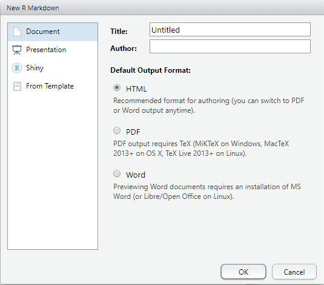
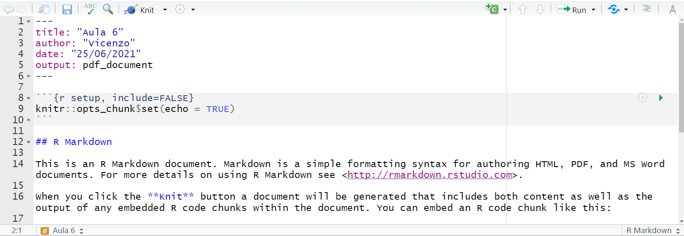

# Módulo VI {#m6}

## Relatórios e pesquisa reproduzível com `rmarkdown`

Antes de falarmos sobre o que é RMarkdown, é importante falar sobre o
Markdown.

Markdown é uma linguagem de *marcação*, ou seja, *não* é uma linguagem
de programação. Linguagens de marcação dizem como algo deve ser
entendido, mas não têm capacidade de processamento e execução de
funções. Por exemplo, HTML é uma linguagem de marcação. Ela apenas diz
como uma página web está estruturada, mas não executa nenhum
processamento. O Markdown, da mesma forma, apenas informa como um
documento está estruturado.

No entanto, a vantagem do Markdown é a sua simplicidade e a
possibilidade de utilização de uma linguagem comum para a criação de
vários tipos de documentos. Por exemplo, um mesmo código Markdown pode
ser convertido para HTML, LaTeX (gera pdf's), docx etc. Para isso, é
necessário um conversor, que lê um código em Markdown e, considerando a
escolha do output desejado, converte o arquivo para a linguagem
desejada. Isto ficará mais claro com os exemplos.

E o que é o *RMarkdown*? Nada mais é do que a possibilidade de
executar-se scripts em R (além de outras linguagens) e incorporá-los a
um arquivo Markdown (extensão `.md`). O pacote `knitr` executará
"pedaços" (`chunk`) de códigos e gerará um arquivo `.md` com os códigos
e seus resultados. Na sequência, o `pandoc`, que é um *conversor*,
converte-o para a linguagem desejada, gerando os arquivos nos formatos
escolhidos (`.html`, `.docx`, `.pdf`, `.odt`). A figura abaixo ilustra o
processo:


## Introdução

Aprendendo a compartilhar e comunicar as análises.


Para este objetivo, o **R** certamente é a ferramenta mais poderosa nos
dias atuais: você pode integrar desde a etapa de análise de dados até o
compartilhamento de seus códigos, gráficos e constatações por meio de
relatórios, slides, artigos em $\TeX$ e até mesmo livros. Esta apostila
mesmo foi toda confeccionada dentro da linguagem **R**.

Nesta seção, vamos focar na produção de relatórios. Veremos também como
confeccionar esses relatórios de modo que eles se adequem
automaticamente a mudanças nos dados que originam sua análise. Além
dessa questão prática, todos os dados e códigos utilizados numa análise
podem ser compartilhados com sua equipe, o que reforça o carater de
reproducibilidade da linguagem **R**. Qualquer outra pessoa poderá
facilmente replicar e verificar/validar os resultados obtidos por você.

A ferramenta que nos permite fazer a maioria dessas coisas que citamos
acima é o pacote `rmarkdown`. Ele é um pacote que gravita em torno do
*core* do `tidyverse`. O `rmarkdown` une escrita de texto e de códigos
num único lugar, por meio de linaguagem de marcação (markdown). A
linguagem de marcação possui uma sintaxe bastante simples e que torna a
produção de texto bem ágil, diferentemente do que ocorre com $HTML$ e
$\LaTeX$, por exemplo. Isso faz com que você não precise sair do RStudio
ou mesmo trocar de janela ou abas para incluir texto, figuras, *outputs*
ou pedaços (*chunk*) de códigos em um documento do tipo R Markdown. O
pacote `rmarkdown` é tão supreendente que a partir dele surgiram pacotes
derivados que permitem a criação de sites e blogs com `blogdown` (veja
[Dados Aleatórios](https://dadosaleatorios.com.br)) e a confecção de
livros e apostilas como esta que você está lendo por meio do pacote
`bookdown`, além de outros.

Para começar a confecionar um relatório em R Markdown, você precisa
criar um novo arquivo do tipo `.Rmd`. Clique em ,
como você normalmente faz para criar um *script*, só que, desta vez
selecione "R Markdown" .

Uma nova janela será aberta no RStudio, em que você deverá escolher que
tipo de arquivo de *output* deseja, se `HTML`, `PDF` ou `.docx`, bem
como seu nome e o título do seu relatório. Vamos escolher `PDF`.



Note que automaticamente será criada uma nova aba no RStudio, com um
modelo de relatório `.Rmd` pré-formatado.

**ATENÇÃO:** Se esta for sua primeira vez utilizando R Markdown no
Windows, o próprio RStudio irá oferecer a instalação de alguns pacotes
necessários (e suas dependências) para rodarmos o `rmarkdown`. Dentre
eles estará o pacote `tinytex`. Trata-se de um pacote que realiza a
instalação mínima de bibliotecas $\LaTeX$ necessárias para a geração de
documentos `.pdf` a partir do R Markdown. Após a instalação dos pacotes,
basta executar no console o código abaixo e depois reiniciar sua sessão
do RStudio.

```{r, eval=FALSE}
tinytex::install_tinytex()
```

Na aba criada, estão todos os dados que você informou anteriormente e
também uma série de exemplos criados automaticamente retratando o
funcionamento de um simples relatório em R Markdown. Note que todo o
texto é editável.



Os documentos são gerados utilizando o pacote `knitr`. Este pacote
funciona como um pacote de apoio de `rmarkdown`, mas você não precisa
conhecê-lo a fundo. *Knit* em inglês significa tricotar ou unir. E é
justamente isso que ele faz, ele costura e une todos os elementos que
você vier a construir ou programar com R Markdown. Se você já quiser
gerar um relatório a partir do exemplo apresentado a você ao criar um
novo arquivo `.Rmd`, você podê fazê-lo clicando no botão *Knit*
 na janela do RStudio. Após escolher um nome e salvar
seu arquivo `.Rmd`, se você escolheu a opção `PDF`, você terá um arquivo
de extensão `.pdf`. Faça testes alterando os arquivos de destino:
`.html` e `.docx` direto no botão `Knit`.

**DICA:** A cada comando novo que você aprender ao longo dessa seção,
sugerimos gerar um novo relatório, de modo que você possa companhar as
modificações feitas no documento. Por isso, sugerimos também que você
apague todo o conteúdo do relatório de sugestão criado ao abrir um novo
documento `.Rmd`, mantendo somente os dados do cabeçalho: `title`,
`author`, `date` e `output`.

## Cabeçalho

No cabeçalho você pode especificar todos os aspectos técnicos de
formatação do seu texto em R Markdown. Existem diversas opções, mas
focaremos nas mais básicas que são as que aparecem na tela neste
momento.

-   `title` contém o título de seu documento;

-   `author` o seu nome;

-   `date` a data de geração do documento;

-   `output` o tipo de documento a ser gerado, se HTML, PDF ou Word.

**Alguns truques úteis:**

-   Caso você queira acrescentar um co-autor, use:

```{rmarkdown}
author:
  - Nome do Autor1
  - Nome do Autor2
```

-   Para adicionar um subtítulo, basta escrever:

```{rmarkdown}
title: "Seu Título"
subtitle: "Subtítulo para o relatório"
```

-   Para não ter que ficar alterando a data manualmente, toda vez que
    você executa o *Knit*, utiliza a função `format()` em conjunto com
    `Sys.time()`. Note que esse código é passado entre sinais de crase
    ``` `` ```.

```{rmarkdown}
date: "`r format(Sys.time(), '%d %B %Y')`"
```

## Formatação de Texto

A sintaxe de formatação de texto do R Markdown é muito simples. Por isso
a produção de textos com ele é muito rápida. Isso vem com o custo de não
se ter tanta flexibilidade de alteração de elementos textuais como numa
linguagem como $\LaTeX$, mas ainda sim, as possibilidades de formatação
são bem consideráveis.

#### Títulos

O símbolo `#` é utilizado para definir títulos. A cada `#` acrescentado,
você desce uma hierarquia e cria um subtítulo do título anterior. Quanto
menos `#` houver antes do seu título, maior a hierarquia e
consequentemente maior a fonte.

```{rmarkdown}
# Título do Artigo
## Subtítulo
### Seção
#### Subseção
```

### Parágrafos

Para redigir um parágrafo basta começar a escrever um texto qualquer.
Para adicionar parágrafos basta pular uma linha, deixando um espaço em
branco entre os parágrafos

```{rmarkdown}
Este é o primeiro parágrafo do seu texto. Você pode escrever normalmente e ele
aparecerá no seu relatório.
Após pular uma linha, você começa um novo parágrafo. Acrescente as ideias que você
desejar neste segundo parágrafo
```

### Formatação da fonte

#### Negrito {.unnumbered}

Para destacar um texto em negrito, coloque `**` ou `__` ao redor do
texto.

Por exemplo:

+-----------------------------------+-----------------------------------+
| Como é escrito no código          | Como aparece no relatório         |
+==================================:+==================================:+
| `Esse é um texto com uma p        | Esse é um texto com uma palavra   |
| alavra destacada em **negrito**.` | destacada em **negrito**.         |
+-----------------------------------+-----------------------------------+
| `Esse é um texto com uma p        | Esse é um texto com uma palavra   |
| alavra destacada em __negrito__.` | destacada em **negrito**.         |
+-----------------------------------+-----------------------------------+

#### Itálico {.unnumbered}

Para destacar um texto em itálico, coloque `*` ou `_` ao redor do texto.

Por exemplo:

+-----------------------------------+-----------------------------------+
| Como é escrito no código          | Como aparece no relatório         |
+==================================:+==================================:+
| `Esse é um texto com uma          | Esse é um texto com uma palavra   |
|  palavra destacada em *itálico*.` | destacada em *itálico*.           |
+-----------------------------------+-----------------------------------+
| `Esse é um texto com uma          | Esse é um texto com uma palavra   |
|  palavra destacada em _itálico_.` | destacada em *itálico*.           |
+-----------------------------------+-----------------------------------+

#### Riscado (ou tachado) {.unnumbered}

Para riscar/tachar um texto, coloque `~~` ao redor do texto.

Por exemplo:

Esse é um texto com uma palavra ~~riscada/tachada~~.

+-----------------------------------+-----------------------------------+
| Como é escrito no código          | Como aparece no relatório         |
+==================================:+==================================:+
| `Esse é um texto com              | Esse é um texto com uma palavra   |
| uma palavra ~~riscada/tachada~~.` | ~~riscada/tachada~~.              |
+-----------------------------------+-----------------------------------+

### Notas de rodapé

Notas de rodapé podem ser inseridas no testo utilizando o esquema
`palavra^[Texto que irá para a nota de rodapé sobre a palavra.]`

```{rmarkdown}
Nesse texto vamos inserir uma nota de rodapé sobre a palavra Estatística^[Estatística
é a disciplina que consiste na coleta, organização, análise e apresentação de dados.]
```

### Confecção de listas e enumeração de itens

#### Listas não-numeradas

Para criar listas **não-numeradas**, podemos utilizar tanto `*` quanto
`-`:

```{rmarkdown}
* item X
* item Y
* item Z
```

-   item X
-   item Y
-   item Z

```{rmarkdown}
- item X
- item Y
- item Z
```

-   item X
-   item Y
-   item Z

Nas listas não-numeradas, para criar subitens, você deve dar 4 espaços
ou `TAB` a partir da margem esquerda e utilizar `-` ou `+`:

```{rmarkdown}
* item X
  - subitem
* item Y
  - subitem
    + subsubitem
* item Z
  + subitem
  + subitem
```

-   item X

    -   subitem

-   item Y

    -   subitem

        -   subsubitem

-   item Z

    -   subitem
    -   subitem

#### Listas numeradas

Para criar listas **numeradas**, utilizamos o numeral acompanhado de
ponto: `1.`, `2.`, `3.` e assim por diante. Para a criação de subitens,
no caso de listas numeradas, utilize **dois** `TAB` ou 4 espaços seguido
de `-`.

```{rmarkdown}
1. item A
    - subitem
2. item B
    - subitem
    - subitem
2. item C
    - subitem
    - subitem
```

1.  item A

    -   subitem

2.  item B

    -   subitem
    -   subitem

3.  item C

    -   subitem
    -   subitem

### Tabelas

Tabelas podem ser adicionadas utilizando `|` para separar as colunas e
`------` para separar o cabeçalho, contendo os nomes das colunas. Note
que os as barras retas que separam as colunas devem estar alinhadas.

```{rmarkdown}
coluna1 | coluna2  | coluna3
--------|----------|--------
Nome1   | Endereço1| Valor1
Nome2   | Endereço2| Valor2
Nome3   | Endereço3| Valor3
```

| coluna1 | coluna2   | coluna3 |
|---------|-----------|---------|
| Nome1   | Endereço1 | Valor1  |
| Nome2   | Endereço2 | Valor2  |
| Nome3   | Endereço3 | Valor3  |

## Inserção de figuras externas

Você pode incluir em seu relatório figuras externas, ou seja, figuras
que não são geradas a partir do **R**. Você pode referenciar tanto
figuras que estão armazenadas localmente em sua máquina, quanto figuras
disponíveis na web.

```{rmarkdown}


```


## Inserção de links

O processo de inserção de links, segue uma abordagem muito parecida a de
inserção de figuras externas. A diferença é que você não precisará mais
de `!`. Além disso, apenas o texto dentro dos colchetes `[]` é que
aparecerá ao leitor. Ao ser clicado, ele será direcionado para o link a
ser passado dentro dos parênteses `()`.

```{rmarkdown}
Clique neste [LINK](https://dadosaleatorios.com.br).
Arquivo disponível em [https://dadosaleatorios.com.br](https://dadosaleatorios.com.br).
```

Clique neste [LINK](https://dadosaleatorios.com.br).

Arquivo disponível em <https://dadosaleatorios.com.br>.

## Fórmulas matemáticas

Você pode inserir fórmulas matemáticas utilizando os princípios de
$\LaTeX$. Veja a função densidade de probabilidade de uma distribuição
Normal. Para isso, você deve passar a fórmula entre `$$` duplos. Note
como a formatação fica elegante.

```{rmarkdown}
$$
f(x;\mu,\sigma^2) = \frac{1}{\sigma\sqrt{2\pi}}
e^{ -\frac{1}{2}\left(\frac{x-\mu}{\sigma}\right)^2 }
$$
```

$$
f(x;\mu,\sigma^2) = \frac{1}{\sigma\sqrt{2\pi}}
e^{ -\frac{1}{2}\left(\frac{x-\mu}{\sigma}\right)^2 }
$$

Se você quiser apresentar alguma fórmula no meio do texto de um
parágrafo, passe a fórmula apenas entre dois `$` simples:

```{rmarkdown}
A função densidade de probabilidade da Distribuição Normal é dada por $f(x;\mu,\sigma^2) =
\frac{1}{\sigma\sqrt{2\pi}} e^{ -\frac{1}{2}\left(\frac{x-\mu}{\sigma}\right)^2 }$.
```

A função densidade de probabilidade da Distribuição Normal é dada por
$f(x;\mu,\sigma^2) = \frac{1}{\sigma\sqrt{2\pi}} e^{ -\frac{1}{2}\left(\frac{x-\mu}{\sigma}\right)^2 }$.

## Inserção e execução de códigos

A maior vantagem de R Markdown provavelmente é a possibilidade de
juntarmos, código, *outputs* e texto tudo no mesmo lugar de forma muito
simples e natural.

### Inserção simples

Para apresentar o seu código ao longo de uma linha, sem necessariamente
executá-lo, utilize crases simples.

```{rmarkdown}
No R, podemos criar um vetor numérico x através do código `x <- c(1:10)`.
```

No R, podemos criar um vetor numérico x através do código
`x <- c(1:10)`.

Se precisamos apresentar um trecho maior de código, podemos fazê-lo
entre crases triplas ```` ``` ````, formado um bloco:

```` {.rmarkdown}
Esse é um trecho de código maior:
```
x <- c(1:10)
sum(x)
```
````

O que resulta em:

Esse é um trecho de código maior:

    x <- c(1:10)
    sum(x)

### Inserções com execução e outros controles

Para começar a apresentar seus códigos juntamente com os respectivos
*outputs* (o que incluem gráficos), utilizamos o que chamamos de
*chunks*, que nada mais são que pedaços de códigos a serem executados
durante o processamento do documento. `rmarkdown` e sua interação com o
RStudio são tão sofisticados que, se você possuir outras linguagens
instaladas na sua máquina, você consegue inclusive, alterar a forma de
exibição de linguagem **R** para Python por exemplo. No entanto, nosso
foco será apenas na configuração dos parâmetros mais utilizados.

Inicialmente, para criar um chunk de código **R**, você deve utilizar as
mesmas crases triplas ```` ``` ```` do exemplo anterior, acompanhadas da
anotação `{r}`. Não se esqueça de fechar o chunk com as mesmas aspas
triplas.

```` {.markdown}
`r ''````{r}
x <- 1:10
sum(x)
```
````

Como resultado, temos agora a impressão do *output* do código anterior:

```{r}
x <- 1:10
sum(x)
```

**DICA:** Também é possível executar trechos de código *inline*, no meio
dos parágrafos. Para isso, utilizamos ````` r ''```` `````r
sum(x)```` ``` Por exemplo: ``` A soma do vetor x é ``` ````r
''\``` `r sum(x)`. ``
<!-- Precisam estar em linhas separadas - descobri na tentativa erro misturando https://bookdown.org/yihui/rmarkdown-cookbook/verbatim-code-chunks.html e -->
<!-- https://support.rstudio.com/hc/en-us/articles/360018181633-Including-verbatim-R-code-chunks-inside-R-Markdown -->
O que resulta em: A soma do vetor x é `r sum(x)`. \#\#\#\#\# Principais
opções de *chunk* As principais opções de chunk são: \* `results`:
especifica como, e se, serão mostrados os resultados do *chunk*; -
opções: - `markup` (*default*): exibe os resultados normalmente -
`hide`: não exibe os *outputs* no relatório final - `hold`: exibe os
resultados apenas ao final do relatório - `asis`: não reformata os
resultados, exibindo (útil quando os *outputs* são códigos HTML, por
exemplo) \* `echo`: especifica se o código do *chunk* deve será exibido
- opções: - `TRUE` (*default*): exibe os códigos acima do *output* -
`FALSE`: exibe apenas o *output* gerado pelo *chunk*

-   `eval`: especifica se o *chunk* será executado ou não

    -   opções:

        -   `TRUE` (*default*): executa o *chunk*
        -   `FALSE`: não executa o *chunk* (útil quando desejamos exibir
            apenas os códigos e não seu *output*)

-   `message` e `warning`: define se as mensagens e demais avisos
    gerados durante a excução do código

    -   opções:

        -   `TRUE` (*default*): exibe mensagens e avisos gerados durante
            a excução do *chunk*
        -   `FALSE`: suprime a exibição de mensagens e warnings (útil
            para suprimir mensagens de carregamento de pacotes)

-   `fig.cap`: especifica uma descrição para a figura gerada no *chunk*

-   `fig.align`: define o alinhamento da figura gerada no *chunk*

    -   opções:

        -   `center` (*default*): alinhamento no centro do documento
        -   `left`: alinhamento à esquerda
        -   `right`: alinhamento à direita

-   `fig.height` e `fig.width`: define a altura e a largura da figura em
    polegadas - *default* é tamanho 7 Se nada for especificado para uma
    determinada opção, as configurações *default* são utlizadas na
    avaliação do código e exibição dos resultados. Essas opções devem
    ser passadas no cabeçalho dos *chunks*, ao lado da letra `r` e
    dentro de das chaves `{}`, por exemplo: `` markdown `r '' ``{r,
    echo=FALSE, message=FALSE} library(dplyr) x \<- 1:10 x %\>% sum()

```{=html}
<!-- -->
```

Você pode também atribuir nomes aos seus *chunks*. Isso é bastante
recomendado quando se está produzindo relatórios relativamente grandes
com vários *chunks*, pois facilitará a identificação de eventuais erros
durante o processo de geração do documento. Os nomes devem ser
informados antes da primeira vírgula, a um espço de distância da letra
r: `{r nome_do_chunk, opções}`

Vejamos alguns exemplos, em que criamos alguns *chunks* com nome, para
realizar a leitura de uma das bases dos módulos anteriores e plotarmos
um gráfico utilizando `gggplot2`:

```` {.markdown}
`r ''````{r leitura, message=FALSE}
require(tidyverse)
tb_game_sales <- read_csv("https://raw.githubusercontent.com/brunolucian/cursoBasicoR/master/datasets/vgsales.csv")
)
```
````

```` {.markdown}
`r ''````{r plot, fig.cap="Fonte: Kaggle", fig.height=5, fig.width=5, fig.align="left"}
library(ggplot2)

 tb_game_sales %>% 
  filter(Platform %in% c("PS3", "PS4"), 
         Genre %in% c("Action","Racing")) %>% 
  ggplot(mapping = aes(x = Platform, y = Global_Sales, fill = Genre)) +
  geom_bar(stat = "identity", position="dodge") +
  ggtitle("Volume de Vendas Globais \npor genero para PS3, PS4")+
  xlab("Plataforma")+
  ylab("Sales Value")+
  scale_fill_manual(name="Genero", values=c("red", "blue"),
                      labels=c("Ação", "Corrida"))+
  theme_bw()
```
````

O que resultaria em:

```{r leitura, message=FALSE}
require(tidyverse)
tb_game_sales <- read_csv("https://raw.githubusercontent.com/brunolucian/cursoBasicoR/master/datasets/vgsales.csv")
```

```{r plot, fig.cap="Fonte: Kaggle", fig.height=5, fig.width=5, fig.align="left"}
 tb_game_sales %>% 
  filter(Platform %in% c("PS3", "PS4"), 
         Genre %in% c("Action","Racing")) %>% 
  ggplot(mapping = aes(x = Platform, y = Global_Sales, fill = Genre)) +
  geom_bar(stat = "identity", position="dodge") +
  ggtitle("Volume de Vendas Globais \npor genero para PS3, PS4")+
  xlab("Plataforma")+
  ylab("Sales Value")+
  scale_fill_manual(name="Genero", values=c("red", "blue"),
                      labels=c("Ação", "Corrida"))+
  theme_bw()
```

## Tabelas mais sofisticadas

Quando usamos um *tibble* ou *data frame* e o *output* de destino é um
arquivo HTML, nos beneficiamos do fato de o R Markdown reconhecer o
formato e imprimir o conteúdo do *tibble* ou *data frame* como uma
tabela do R Markdown. Para isso basta incluir as seguintes linhas no
cabeçalho YAML, alterando <opção> para `paged`, `kable` ou `tibble`.
Vamos ver um exemplo com paged

```{rmarkdown}
---
title: "Título"
output:
  html_document:
    df_print: <opção>
---
```

Vamos utilizar a opção `df_print: paged`, que vai fazer com a tabela
seja imprida de forma paginada, exibindo apenas algumas linhas (e
colunas) de cada vez e, permitindo aos usuários navegarem por seu
conteúdo de forma interativa. Após alterar o cabeçalho, basta chamar o
objeto `tb_games_sales` de dentro de um chunk.

```` {.markdown}
`r ''````{r tabela, cols.print = 5, rows.print = 5}
tb_game_sales
```
````

Note que os argumentos `cols.print` e `rows.print` controlam o número de
colunas e linhas a serem exibidos em cada paginação.

O resultado será o seguinte:

<!--  -->

```{r tabela, cols.print = 5, rows.print = 5}
rmarkdown::paged_table(tb_game_sales, options = list(rows.print = 15))
```

**DICA:** Se você deseja controlar melhor o output das tabelas, ou busca
gerar tabelas mais sofisticadas em relatórios PDF ou Word, podemos
utilizar a função `knitr::kable` dentro de um chunk do R Markdown.

```{r, eval = FALSE}
knitr::kable(tb_game_sales[1:5, 1:5], format = "latex")
```

No código acima, apresentamos um extrato dos dados (5 primeiras linhas e
5 primeiras colunas) do data frame de nome `tb_game_sales` que
utilizamos ao longo do curso. A opção `format = latex` é adequada para a
produção de tabelas no estilo $\LaTeX$.

```{r, echo = F}
knitr::kable(tb_game_sales[1:5, 1:5], format = "latex")
```

<!--  -->

Se objetivo for deixar a tabela com uma aparência ainda melhor você pode
utilizar a opção `booktabs = TRUE`, o que faz com que a engine do pandoc
utilize o pacote $\LaTeX$ booktabs para gerar a tabela. Há diversas
outras opções para melhorar ainda mais o estilo da tabela, como
acrescentar notas de rodapé, títulos, cores, etc. Para isso você deve
investigar outras opções da própria função `kable` e o pacote
`kableExtra` que amplia as possibilidades de customização.

------------------------------------------------------------------------

### Referências da seção

-   Allaire, J. J.; Xie, Y.; McPherson, J.; Luraschi, J.; Ushey, K.;
    Atkins, A.; Wickham, H.; Cheng, J.; Chang, W.; Iannone, R. (2019).
    *rmarkdown: Dynamic Documents for R*. R package version 1.13. URL
    <https://rmarkdown.rstudio.com>.

-   Xie, Y. (2019). *R MArkdown Cookbook*. CRS Press. Disponível em:
    <https://bookdown.org/yihui/rmarkdown-cookbook/>

-   Xie Y.; Allaire, J. J.; Grolemund, G. (2018). *R Markdown: The
    Definitive Guide*. Boca Raton, Florida: Chapman; Hall/CRC.
    Disponível em: <https://bookdown.org/yihui/rmarkdown>.

-   Mayer F.; Zeviani, W. (2019). *Pandoc e Markdown*. Cursos. UFPR.
    Disponível em: <http://cursos.leg.ufpr.br/prr/capMarkdown.html#>.

-   *R MARKDOWN REFERENCE GUIDE*. Disponível em:
    <https://rstudio.com/wp-content/uploads/2015/03/rmarkdown-reference.pdf>.
